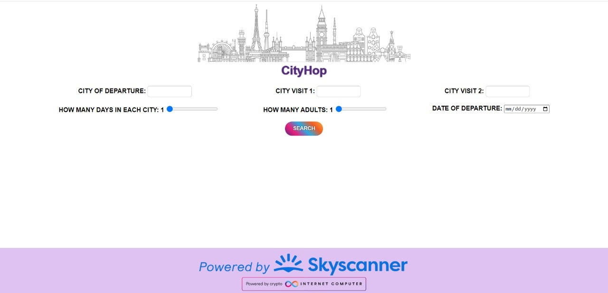
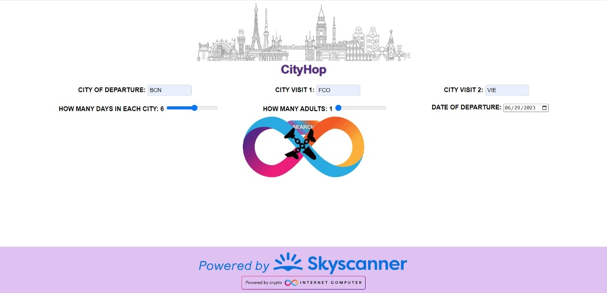
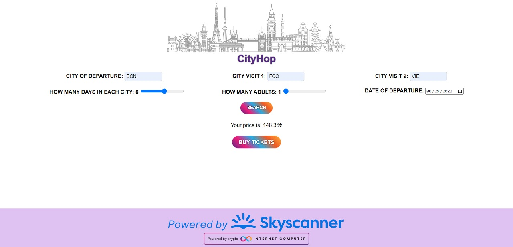

# CityHop.es
CityHop.es Project for the  Blue Sky Track of the Encode Buidl Hackaton

The usage is simple, you have to enter the Departure city and the 2 cities you want to travel (in IATA format), how many days, how many adults and the departure date.
After you input the information you can click the "Let's travel" button which after a few seconds will show you the cheapest price for the combination and a buy tickets link which will guide you to the online travel agency listing the flights.

Right now the scope of the project is reduced due to time limitations, only 2 cities can be selected and a fixed date to stay in each city, with 2 cities, there are only 2 possible routes which simplifies the process of getting the data.

We're using the Skyscanner API to get the flights and prices information.

Due to the number of api calls we have to use we decided to do it in the frontend with a cloudfare serviceworker to maintain the API key secret

Future implementations will have n-cities, autosuggest for city name, range for days and range for departure date.

Screenshot1

Screenshot2

Screenshot3
